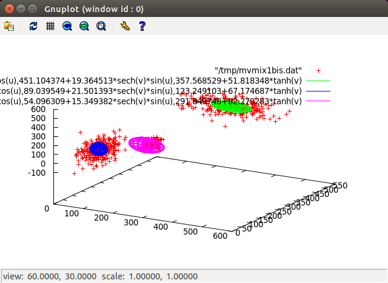

Univariate statistics:
----------------------
* unirandp.c      Generate a Uniform Random Probability (0.0<p<1.0)
* invnorm.c       Compute the Inverse Normal CDF (Peter J. Acklam)
* normcdf.c       Compute the univariate Normal CDF (Abramowiz and Stegun 1964)
* normpdf.c       Compute the univariate Normal PDF
* normsamp.c      Generate Normal Samples (Box-Muller)

Bivariate statistics:
---------------------
* bvmix.c         Bivariate Mixtures (Shotaro Akaho 2001)
* bvmodnorm.c     Normal module for bvmix
* bvmoduni.c      Uniform module for bvmix
* bvncdf.c        Compute the Bivariate Normal CDF integral (Cumulative Distribution Function) (Hull, 1993)
* bvnpdf.c        Numerical computation of the Bivariate Normal PDF (Probability Distribution Funcion)
* bvnsamp.c       Generate correlated BiVariate Normal samples

Multivariate statistics:
------------------------
* mvmix.c         Multivariate Mixtures
* mvmodnorm.c     Normal module for mvmix
* mvmoduni.c      Uniform module for mvmix
* mvnsamp.c       Generate correlated Multivariate Normal Samples (with Cholesky decomposition)
 mvutils.c       Matrix and vector utilities for Multivariate statistics

Misc:
-----
* prob_test.c     Tests of the above


Example of use: finding 3 gaussian kernels

After a dozen of iterations...



```
kernel 0 weight 0.008567
--
kernel 1 weight 0.329915
mu:
|      314.051009|
|      451.104374|
|      357.568529|
covariance matrix:
|     4536.292629       121.080205        70.424394 |
|      121.080205       374.984352       -14.281386 |
|       70.424394       -14.281386      2685.141184 |
--
kernel 2 weight 0.286790
mu:
|       95.959635|
|       89.039549|
|      123.249103|
covariance matrix:
|      722.296765       175.224044       697.816596 |
|      175.224044       462.309905       636.365172 |
|      697.816596       636.365172      4512.438561 |
--
kernel 3 weight 0.374728
mu:
|      278.446285|
|       54.096309|
|      291.849748|
covariance matrix:
|     3496.551162      -638.048528      4556.283832 |
|     -638.048528       235.603541      -780.323339 |
|     4556.283832      -780.323339      6769.880339 |
--
likelihood -15.774254
```
